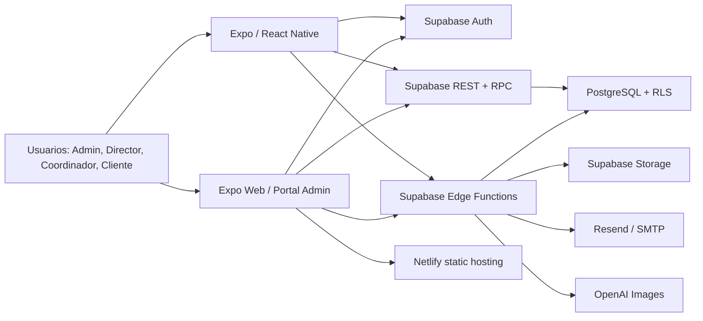

# Contexto de Continuidad - SupportMobile

Actualizado: 2026-08-06 (America/Bogota)

Este documento resume el estado funcional, técnico y operativo del proyecto para continuar el desarrollo desde otro computador sin depender del historial del chat. No contiene secretos.

## 1. Objetivo general

SupportMobile digitaliza la operación de personal logístico de Support Colombia. Reemplaza hojas de cálculo, conversaciones de WhatsApp y documentos dispersos mediante una aplicación móvil y un portal web que centralizan:

- Alta, activación, documentación, contratación y desvinculación de contratistas.
- Planeación, ejecución, cierre y aprobación de operaciones.
- Operaciones cobradas por turno y operaciones de descargue por unidad.
- Asistencia, novedades, horas extra y cantidades descargadas.
- Ventas, costos, reglas contractuales y nómina.
- Solicitudes de personal, dotación e informes.
- Administración de usuarios, clientes, áreas, turnos, tarifas y catálogos.

## 2. Arquitectura actual



- Un solo proyecto Expo sirve iOS, Android y web.
- `src/SupportApp.tsx` contiene la navegación y la mayor parte de la UI.
- `src/services/data.ts` centraliza consultas Supabase, RPC y mapeos.
- PostgreSQL concentra las reglas sensibles en RPC `security definer`, constraints y RLS.
- La carga inicial se realiza después de autenticar mediante `loadUserContext()` y `loadAppData()`.
- La renovación del token solo actualiza la sesión en memoria; no debe recargar datos ni devolver al inicio.
- El perfil del contratista tiene refresco selectivo y no ejecuta una recarga global.
- El portal administrativo pesado se activa para `ADMIN` en web; en móvil Admin usa acciones rápidas.

## 3. Stack tecnológico

- Expo SDK 54, React 19.1, React Native 0.81.5 y TypeScript 5.9.
- Expo Router está instalado, pero la navegación principal actual es estado interno en `SupportApp.tsx`.
- Supabase: Auth, PostgreSQL, RLS, RPC, Storage y Edge Functions.
- `@supabase/supabase-js` 2.108.x.
- Netlify para la exportación web estática (`dist`) con redirect SPA.
- Resend configurado como correo de onboarding y SMTP de Supabase Auth.
- OpenAI Images para la foto corporativa del onboarding.
- `pdf-lib` para PDF de cédula y contrato AcroForm.
- `react-native-pdf` / `react-native-blob-util` para visualización nativa y visor web propio.
- `react-native-svg` para gráficas de Informes.
- Cámara, documentos, filesystem e image manipulator mediante módulos Expo.

Comandos principales:

```bash
npm install
npm run start:lan       # Expo Go por LAN, puerto 8081
npm run start:tunnel    # alternativa mediante ngrok
npm run typecheck
npm run export:web
npx supabase migration list
npx supabase functions list
```

## 4. Estructura de carpetas importante

```text
support-colombia-mobile/
  App.tsx                         Entrada visual
  index.ts                        Entrada Expo
  src/
    SupportApp.tsx                Navegación, pantallas y estilos principales
    types.ts                      Contratos TypeScript del dominio
    services/data.ts              Acceso a datos, RPC, Storage y Edge Functions
    lib/supabase.ts               Cliente Supabase y persistencia de sesión
    lib/cedula-pdf.*              Generación de PDF desde fotos de cédula
    components/pdf-viewer.*       Visor PDF web y nativo
    data/colombia-locations.ts     Departamentos y municipios del onboarding
  supabase/
    migrations/                   Evolución SQL, RLS, RPC y catálogos
    functions/
      admin-create-user/           Invitación de usuarios por Supabase Auth
      send-contractor-onboarding-email/ Correo con token de onboarding
      contractor-onboarding/      Formulario público, selfie, contrato y firma
      _shared/                     CORS y constantes de onboarding
  scripts/
    upload-data-policy.mjs         Publica política en Storage
    upload-email-banner.mjs        Publica banner del correo
    seed-contractor-documents.mjs  Documentos demo
    preview-direct-payroll.sql     Preview de nómina DIRECTO
  assets/                          Logos e iconos
  netlify.toml                     Build y redirect SPA
  eas.json                         Perfiles EAS, aunque también se usan builds nativas
```

## 5. Base de datos y tablas relevantes

### Identidad y autorización

- `auth.users`: cuentas administradas por Supabase.
- `user_profiles`, `roles`, `user_roles`, `user_clients`.
- Roles: `ADMIN`, `DIRECTOR`, `COORDINATOR`, `CLIENT`.
- Acceso mediante `is_active_user()`, `has_role()` y `has_client_access()`.
- Cliente y Coordinador quedan limitados a clientes asignados; Director y Admin tienen alcance global según la política.

### Catálogos operativos

- `clients`, `area`, `shift`.
- `operation_type`: `TURNO`, `DESCARGUE`.
- `service_unit_type`: Cajas, Camión, Huevos y Tonelada.
- `document_type`, `transport_type`, `civil_state_type`, `education_level_type`.
- `contract_type`: `DIRECTO`, `PAQUETE COMPLETO`, `SOLO ARL`.
- `contract_status`: `ACTIVO`, `PENDIENTE`, `INACTIVO`.
- `attendance_status`, `workwear_type`, `contractor_termination_reasons`.
- El modelo legado `client_services`, `service_catalog` y `service_units` fue eliminado.

### Contratistas

- `contractor`: identidad, contacto, nacimiento, residencia, seguridad social, tallas, emergencia, disponibilidad y foto.
- `contractor_contract`: contratos vigentes e históricos.
- `contractor_document_types`, `contractor_documents`, `app_files`.
- `contractor_onboarding_invites`, `contractor_data_policy_acceptances`.
- `contractor_contract_signatures`.
- `contractor_workwear`, `contractor_workwear_movements`.

### Operaciones y finanzas

- `operation`, `operation_assignment`.
- `personnel_request`.
- Turnos: `service_rates`, `area_extra_hour_rates`, `shift_sales`, `shift_costs`.
- Descargues: `service_unit_rates`, `discharge_sales`, `discharge_costs`.
- Costos: `cost_concepts`, `contract_type_cost_rules`.
- Las tarifas y reglas tienen vigencias; no deben editarse destructivamente ni solaparse.
- Ventas y costos se materializan al aprobar una operación `CERRADO`.
- `operation_assignment` conserva snapshots de precio y totales.

### Nómina DIRECTO

- `contract_type_payroll_rules`.
- `contractor_payroll_periods`.
- `contractor_payroll_allocations`.
- `payroll_replaced_shift_costs`.
- `DIRECTO` usa salario mensual fijo configurable; `SOLO ARL` y `PAQUETE COMPLETO` conservan costo por turno.
- Las horas extra continúan como costo adicional por asignación para todos.
- Los periodos `CLOSED` son inmutables.

### RPC principales vigentes

- Turnos: `create_operation_with_assignments`, `finalize_operation`, `review_operation`.
- Descargues: `create_discharge_operation_with_assignments`, `finalize_discharge_operation`, `review_discharge_operation`.
- Disponibilidad: `get_available_contractors_for_operation`, `get_available_contractors_for_discharge`, `get_available_service_units`.
- Tarifas: `current_shift_rate`, `current_area_extra_hour_rate`, `current_service_unit_rate`.
- Contratistas: `create_contractor_draft`, `register_contractor_document`, `select_contractor_contract_type`, `terminate_contractor`.
- Dotación: `register_contractor_workwear_movement`, resúmenes e historial.
- Informes: `get_statistics_by_date_range`, `get_director_reports` y métricas de descargue.
- Nómina: `calculate_direct_payroll`, `update_direct_payroll_draft`, `close_direct_payroll`, `get_admin_direct_payroll`, `preview_direct_payroll_history`, `reprocess_direct_payroll_history`.

### Fechas

- Días operativos se guardan como `date` con calendario Colombia.
- El esquema público fue normalizado a `timestamp without time zone` con hora local `America/Bogota`.
- Helpers: `colombia_now()` y `colombia_today()`.
- Esta decisión es deliberada, aunque difiere de la práctica habitual de almacenar instantes UTC.

### Storage

- `contractor-documents` (privado): cédula, activación, contratos pendientes/firmados y firma contractual dentro de `contractor/{id}/...`.
- `contractor-profile-photos` (privado): selfie original y foto corporativa.
- `supplies`: política, banners, logo, plantilla de camisa y plantilla contractual AcroForm.
- Los accesos privados deben usar URLs firmadas y respetar el rol.

## 6. Funcionalidades implementadas

### Autenticación

- Login, sesión persistente y recuperación de contraseña.
- Recuperación finaliza en `/reset-password` en la web.
- Creación/invitación de usuarios desde Admin mediante Edge Function.
- Navegación diferenciada por rol.

### Operaciones

- Registro inicial con fecha seleccionable, cliente, área, turno o unidad y contratistas activos.
- `TURNO`: tarifa por turno, asistencia, novedades, horas extra, cierre y aprobación.
- `DESCARGUE`: tipo de unidad, cantidades planeadas/reales y reparto por contratista.
- Registro final permite asistencia, novedades y adición de contratistas.
- Director aprueba o solicita cambios.
- Coordinador ve alerta y filtro para operaciones `CAMBIOS_SOLICITADOS`.
- Validaciones backend impiden asignaciones no autorizadas o contratistas inactivos.

### Contratistas

- Creación inicial con datos mínimos y fecha de nacimiento.
- Cédula mediante PDF o fotos frente/reverso convertidas a PDF A4.
- Activación por Director con tipo de contrato y documentos ARL, Policía y Procuraduría.
- Perfil completo interno y perfil restringido para Cliente.
- Documentos versionados: no se borra el histórico, se muestra el último por tipo.
- Tipo adicional `PILA`.
- Desvinculación con fecha, causa y observación.
- Contacto de emergencia visible solo internamente.
- Pull-to-refresh selectivo del perfil en móvil.

### Onboarding público

- Correo Resend con token hash, vencimiento de 7 días y un solo uso.
- Formulario de datos personales con departamentos/municipios de Colombia.
- Selfie guiada con overlay, política de datos y aceptación auditada.
- Generación de foto corporativa mediante OpenAI y plantilla de camisa.
- Contrato generado desde PDF AcroForm oficial.
- Revisión web, firma manuscrita, ubicación y evidencia técnica.
- Contrato firmado visible en Documentos solo para Director.

### Dotación

- Entrega, devolución y baja por desgaste.
- Saldo por tipo y validación para no devolver más de lo pendiente.
- Historial desplegable en perfil y vista global en Admin.

### Informes

- Filtros por rango de fechas, empresa y contratista.
- Director: pestañas Operación, Contratistas, Cliente y Nómina.
- Gráficas amplias en web y versión compacta móvil.
- Venta, costos, nómina, asistencia, turnos, horas extra y descargues.
- Coordinador y Cliente conservan métricas limitadas a su alcance.

### Administración mixta

- Móvil: usuarios, contratistas y catálogos con acciones rápidas.
- Web: dashboard, usuarios, contratistas, contratos, clientes/áreas/turnos, tarifas, nómina, conceptos, reglas y dotación.
- Tarifas filtradas de forma dependiente Empresa -> Área -> Turno/Unidad.
- Reglas filtrables por tipo de contrato.
- Catálogos se inactivan en lugar de borrar datos usados históricamente.

## 7. Funcionalidades en desarrollo o validación

- Estabilización de la nómina mensual fija para contratos `DIRECTO`.
- Validación del reproceso histórico y conciliación con `COSTO_TURNO` anterior.
- Pruebas funcionales completas del flujo de Descargue y su materialización financiera.
- Pruebas visuales del onboarding, especialmente foto corporativa, contrato y firma en navegadores móviles.
- Pruebas RLS sistemáticas por los cuatro roles; actualmente no existe suite automatizada.

Estado remoto consultado el 2026-08-06:

- 49 contratistas y 49 contratos.
- 61 operaciones: 60 Turno `CERRADO` y 1 Turno `CAMBIOS_SOLICITADOS`.
- 226 asignaciones, 218 `shift_sales` y 1332 `shift_costs`.
- No hay ventas/costos de Descargue materializados todavía.
- Nómina: 3 periodos `DRAFT` de julio y 3 de agosto de 2026.
- No hay asignaciones salariales ni costos históricos reemplazados aún; esto ocurre al cerrar periodos.

## 8. Cambios recientes

Últimos commits de la rama actual:

- `f802d9f` alerta/filtro de cambios solicitados para Coordinador.
- `167e16b` foco de formularios web y calendario de nacimiento en año 2000.
- `f0c6043` corrección de ambigüedad en asignaciones de nómina.
- `dfb707b` nómina mensual fija para contratos DIRECTO.
- `4928c9e` estabilización de sesiones y costos de turno.
- `adc0056` fecha seleccionable en Registro Inicial.
- `6f86a6e` aprobación/finalización desde web.
- `22db040` costo de hora extra.
- `3613a50` operaciones de Descargue.
- `adbc9ee` eliminación del modelo legado de servicios.

Cambios remotos de datos no versionados recientemente:

- Se crearon contratistas de prueba IDs `68` a `76`, activos desde `2026-07-29`, con contrato `SOLO ARL` y cuatro documentos obligatorios.
- La operación `#55` se movió de `2026-08-03` a `2026-08-01` cuando estaba `EN_CURSO`.
- La operación `#63` y su asignación `#228` fueron eliminadas; no tenían ventas ni costos.

## 9. Decisiones técnicas tomadas

- No usar IDs fijos de catálogos en funciones nuevas; resolver por código o nombre estable.
- Backend/RPC es la autoridad de reglas de negocio y permisos, no el frontend.
- Cliente nunca recibe campos sensibles que solo se ocultan visualmente; se usan RPC/modelos limitados.
- Solo contratos `ACTIVO` permiten asignar contratistas.
- Tarifas, reglas y contratos históricos no se sobrescriben destructivamente.
- Ventas/costos se materializan al aprobar para conservar snapshots auditables.
- `COSTO_TURNO` es directo desde la tarifa vigente para `SOLO ARL` y `PAQUETE COMPLETO`.
- `DIRECTO` no genera costo por turno; usa nómina mensual fija más horas extra.
- Turnos y Descargues mantienen flujos/RPC/tablas financieras separados para no romper el flujo original.
- Documentos se versionan; el histórico se conserva y la UI muestra el último.
- Todos los archivos contractuales viven bajo la carpeta del contratista en `contractor-documents`.
- Service role solo se usa en Edge Functions o scripts locales administrativos, nunca en el bundle cliente.
- La función pública de onboarding se protege mediante token hash y estados, no JWT de usuario.
- El Admin web y la app móvil comparten proyecto y autenticación, pero tienen UI distinta.

## 10. Errores, riesgos y problemas pendientes

1. **Nómina aún no cerrada:** julio y agosto están en `DRAFT`; por eso no existen allocations ni reemplazos históricos y no entran como salario cerrado en Informes.
2. **Descargue sin evidencia financiera remota:** las tablas existen, pero actualmente están vacías; ejecutar un ciclo real completo antes de producción.
3. **Migración base no autosuficiente:** `202606110001_support_colombia_v1.sql` comienza alterando tablas preexistentes (`operation`, `contractor`, etc.). Un proyecto Supabase vacío puede no reconstruirse solo con `db reset`. Antes de migrar a otro Supabase debe crearse una migración baseline completa obtenida del esquema remoto.
4. **UI monolítica:** `SupportApp.tsx` concentra gran parte de las pantallas y estilos; cambios amplios tienen alto riesgo de regresión y conviene modularizar gradualmente.
5. **Cobertura automatizada insuficiente:** hay typecheck/export, pero no suite de integración/RLS/E2E versionada.
6. **Foto corporativa con IA:** la preservación facial y la unión con la camisa han sido inestables; mantener fallback y realizar QA visual.
7. **Expo Go vs build nativo:** módulos como `react-native-pdf` y `react-native-blob-util` requieren validar también con development/release build; Expo Go no representa todas las capacidades nativas.
8. **Funciones sin verificación JWT en gateway:** `contractor-onboarding` es público por diseño y `admin-create-user` valida manualmente el bearer token y rol Admin. No retirar esas validaciones internas.
9. **Datos de prueba remotos:** hay contratistas, operaciones y documentos ficticios mezclados con pruebas funcionales; no asumir que el remoto está limpio.
10. **README desactualizado:** describe principalmente V1 y cuentas demo antiguas; usar este documento como referencia actual.

## 11. Archivos modificados durante el desarrollo

Archivos centrales con cambios funcionales relevantes:

- `src/SupportApp.tsx`
- `src/services/data.ts`
- `src/types.ts`
- `src/lib/supabase.ts`
- `src/lib/cedula-pdf.ts`
- `src/lib/cedula-pdf.web.ts`
- `src/components/pdf-viewer.tsx`
- `src/components/pdf-viewer.native.tsx`
- `src/components/pdf-viewer.web.tsx`
- `src/data/colombia-locations.ts`
- `app.json`, `package.json`, `netlify.toml`, `eas.json`
- `supabase/functions/admin-create-user/index.ts`
- `supabase/functions/send-contractor-onboarding-email/index.ts`
- `supabase/functions/contractor-onboarding/index.ts`
- `supabase/functions/_shared/onboarding.ts`
- Migraciones desde `202606120001` hasta `202607310002`.

El último cambio de UI versionado antes de este documento fue solamente en `src/SupportApp.tsx` (alerta de cambios solicitados).

## 12. Próximos pasos recomendados

1. Clonar el repositorio y continuar desde `agent/improve-admin-rates-ux` o integrar esa rama deliberadamente a la rama principal.
2. Crear `.env` local con `EXPO_PUBLIC_SUPABASE_URL`, `EXPO_PUBLIC_SUPABASE_ANON_KEY` y `EXPO_PUBLIC_WEB_URL`. Añadir `SUPABASE_SERVICE_ROLE_KEY` solo si se ejecutarán scripts administrativos locales; nunca subirla.
3. Ejecutar `npm install`, `npm run typecheck` y `npm run export:web`.
4. Instalar/autenticar Supabase CLI y enlazar el proyecto remoto. El proyecto actual está enlazado al ref `pawgxliprfmgylrytqiw`.
5. Confirmar que todas las migraciones hasta `202607310002` estén aplicadas. Al 2026-08-06 local y remoto coinciden.
6. Confirmar Edge Functions activas: `send-contractor-onboarding-email` v12, `contractor-onboarding` v44 y `admin-create-user` v5.
7. Revisar el borrador de nómina de julio, conciliar valores y cerrar solo con aprobación; después comprobar allocations, reemplazos e Informes.
8. Ejecutar un Descargue completo: inicial, final, aprobación, ventas, costos e Informes.
9. Crear una migración baseline autosuficiente antes de levantar un Supabase nuevo desde cero.
10. Añadir pruebas automatizadas para RPC críticas y RLS por rol.
11. Modularizar `SupportApp.tsx` por dominios sin mezclarlo con nuevas funcionalidades.
12. Actualizar README y documentar despliegues Netlify, builds nativos y secretos Edge.

## Puesta en marcha desde otro computador

```bash
git clone https://github.com/KevinReyR/SupportMobileDemo.git
cd SupportMobileDemo
git checkout agent/improve-admin-rates-ux
npm install
# Crear .env local; no copiarlo a Git.
npm run typecheck
npm run start:lan
```

Variables públicas del frontend:

```text
EXPO_PUBLIC_SUPABASE_URL
EXPO_PUBLIC_SUPABASE_ANON_KEY
EXPO_PUBLIC_WEB_URL
```

Secretos de Edge Functions, configurados en Supabase y nunca en el frontend:

```text
SUPABASE_SERVICE_ROLE_KEY
RESEND_API_KEY
ONBOARDING_FROM_EMAIL
ONBOARDING_WEB_URL
OPENAI_API_KEY
OPENAI_IMAGE_MODEL (opcional)
```

Validación mínima antes de desarrollar:

```bash
npm run typecheck
npm run export:web
$env:SUPABASE_TELEMETRY_DISABLED='1'; npx supabase migration list
$env:SUPABASE_TELEMETRY_DISABLED='1'; npx supabase functions list
```

Estado Git al iniciar este documento: rama `agent/improve-admin-rates-ux`, commit `f802d9f`, árbol limpio antes de añadir `CODEX_CONTEXT.md`.
